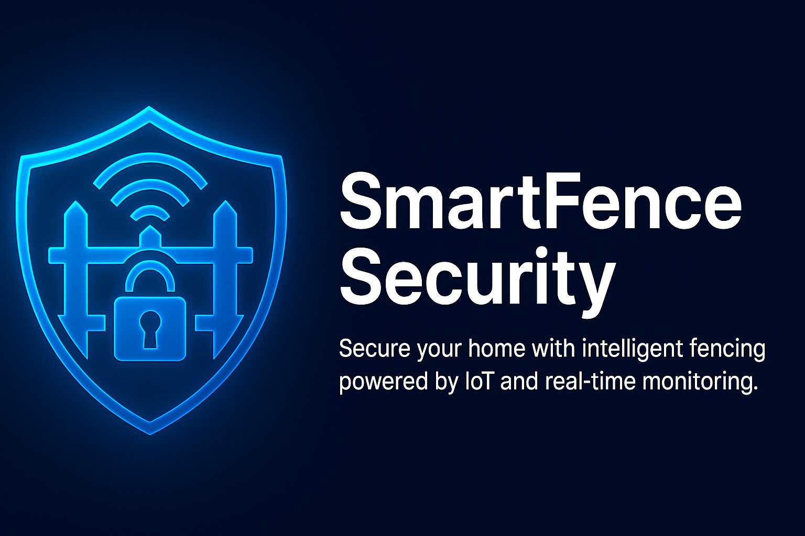
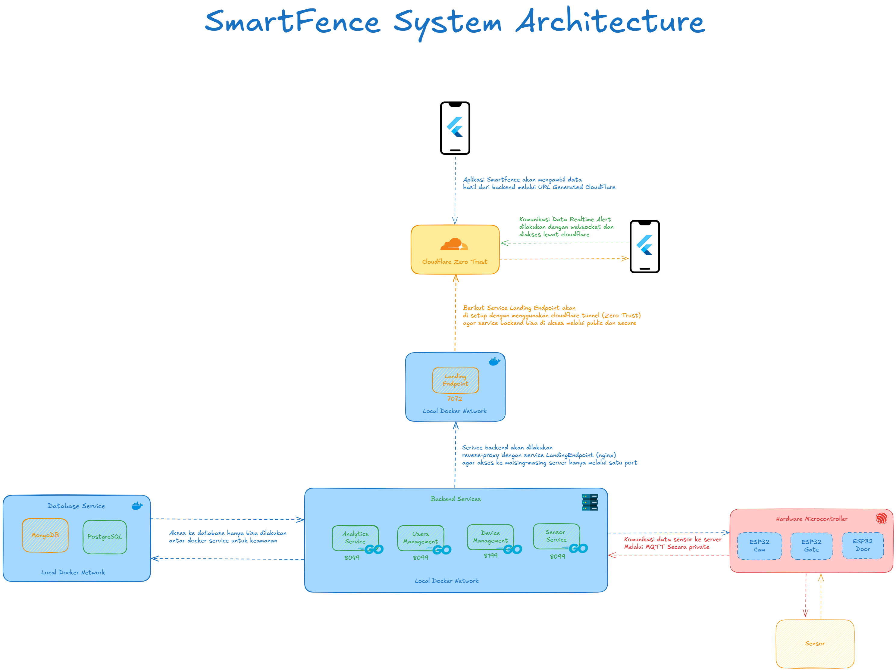

# 🛡️ SmartFence Security System

Secure your home with intelligent fencing powered by IoT, automation, and real-time monitoring.



---

## 🧰 System Overview

SmartFence integrates IoT devices and modern software technologies to provide a robust and reliable smart security system designed for physical access control and automation.

---

## 🔩 Hardware Components

### 🔌 Microcontroller
- **ESP32**
- **ESP32-CAM**

### 🎯 Sensors & Actuators
- **RCWL-0516** – Motion Detection Sensor
- **SW420** – Vibration Sensor
- **NFC Module** – RFID/NFC Authentication
- **2-Channel Relay Module** – Actuator Control
- **Solenoid Lock** – Door Lock Mechanism

### ⚡ Power Supply
- **12V DC Adapter** – Powers solenoids and relays

---



## 💻 Software Architecture

### 🌐 Backend
- **Golang** – Built with [Fiber Framework](https://gofiber.io/)
- **Docker** – Containerized microservices
- **Nginx** – Reverse proxy for secure routing

### 📱 Frontend
- **Flutter** – Cross-platform mobile application for system control and monitoring

### 🗄️ Database
- **PostgreSQL** – Stores user/authentication data
- **MongoDB** – Stores logs, device telemetry, and sensor data

---

## 🚀 Getting Started

### ✅ Prerequisites
- Docker & Docker Compose
- Bash Shell (Linux/macOS or WSL on Windows)

### ▶️ How to Run

```bash
bash ./RunnerScript/start.sh

